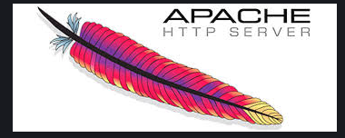
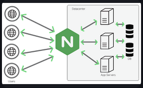
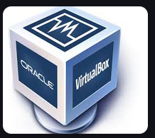
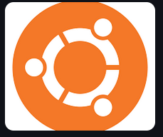

# Deliverable 1 

## Basic Terminology 

### What is a web server? Hardware and software side
* A web server is a system that handels requests for a web page, files, and other online resources, delivering them to users vis the internet. It consists of hardware and software components to work together to serve websites.
  ## Hardware side
    * Cpu & memory, storage, network interface, cooling & power supply,and redundancy systems
  ## Software side
    * Web server software, operating system, HTTP protocol, security layers, and database & backen services

### What are some different web server applications?

| Application Name | Project's Website |
| ---------------  | ----------------- |
| Appache          | Example 1         |
| NGINX            | Example 2         |
| Microsoft 11S    | Example 3         |

# Example 1

   * One of the most widely used web servers.
   * Oen-source and highly configurable with models.

# Example 2

  * Known for its speed and ability to handle high traffic
  * Often used as a reverse proxy, load balancer, and static file server.

# Example 3

  * A web server developed by Microsoft for Windows-based environments.
  * Integrated with ASP.NET for running web applications.

### What is virtualization?
Virtualization is the process of creating virtual versions of computing resources, such as servers, storage, networks, or even operating systems, to improve efficiency and scalability. It allows multiple virtual instances to run on a single physical system, reducing hardware costs and optimizing resource usage.

## Types of Virtualization
* Server, network, storage, operating system, and application.

### What is a virtualbox?
VirtualBox is an open-source virtualization software that allows users to run multiple operating systems on a single physical machine. Developed by Oracle, it enables the creation of virtual machines (VMs) where different OS environments—like Linux, Windows, or macOS—can operate simultaneously.

### What is a virtual machine?
A virtual machine (VM) is a software-based simulation of a physical computer that runs an operating system independently on a host machine. It allows users to create multiple isolated computing environments on a single system, improving flexibility, security, and resource efficiency

### What is Ubuntu Server?
Ubuntu Server is a Linux-based operating system designed specifically for server environments. It is an open-source, stable, and secure OS used for hosting websites, cloud services, databases, and more.

### What is a firewall?
A firewall is a security system that monitors and controls network traffic based on predefined rules. It acts as a barrier between trusted internal networks and untrusted external networks, such as the internet, protecting devices from unauthorized access, cyber threats, and malicious activities.

### What is SSH?
SSH (Secure Shell) is a cryptographic network protocol used to securely connect to remote systems over an unsecured network. It enables encrypted communication between a client and a server, commonly used for remote administration and file transfers

 
