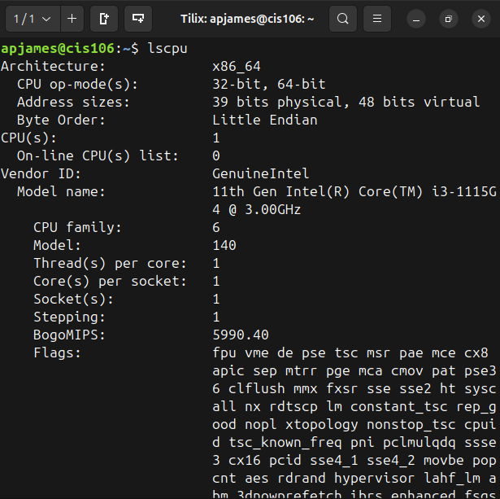
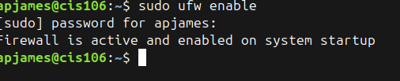
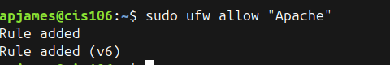
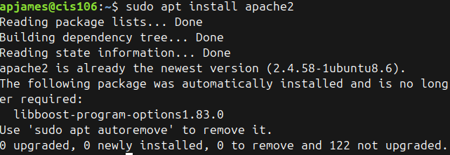
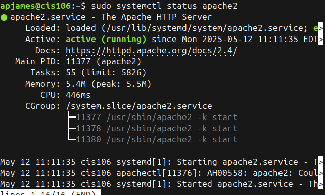
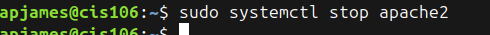
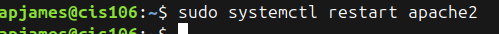
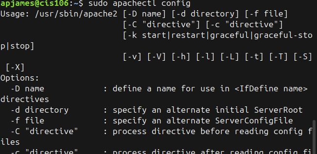
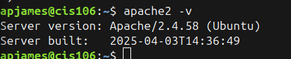

## Deliverable 2

### What is Ubuntu server hardware specification

### What is Ubuntu server log in screen

### What is the IP address of your Ubuntu server virtual machine?
* 127.0.0.1

### How do you enable the Ubuntu Firewall? 
* sudo ufw enable

### How do you add Apache to the Firewall?
* sudo ufw enable "Apache"

### What is the command you used to install Apache? 
* sudo apt install apache2

### What is the command you use to check if Apache is running?
* sudo systemctl status apache2

### What is the command you use to stop Apache?
* sudo systemctl stop apache2

### What is the command you use to restart Apache?
* sudo systemctl restart apache2

### What is the command used to test Apache configuration?
* sudo apachectl config

### What is the command used to check the installed version of Apache?
* apache2 -v

## ufw
This is used for managing firewall rules in Linux. It simplifies configuration by providing an easy-to-use command-line interface.

### How it works
* Allows or block network traffic
* It works by enabling and defining rules for ports, services, and IP addresses.
* It helps secure a server by restricing access while permitting neccessary connections. 

### Examples
* Allowing Apache web server traffic
  * sudo ufw allow 80/tcp
* Denying incoming SSH connections
  * sudo ufw deny 22/tcp

## systemctl
a system and service manager for Linux, used to control systemd services. It allows users to start, stop, restart, enable, disable, and check the status of services running on Linux system.

### How it works
* It interacts with systemd, which is responsible for managing services and processes
* It can control services, manage system states, and handle system boots. 

### Example
* Checking the status of Apache Web server
  * sudo systemctl ststus apache2
* enabling SSH on startup
  * sudo systemctl enable ssh

## What are the most common commands to troubleshoot Apache errors? 
* View Apache error log
  * sudo tail -f /var/log/apache2/error.log
    * Using this command allows you to see error messages as they occur, which is useful for debugging issues with your Apache server. If you’re troubleshooting a problem, looking for patterns in the errors can help identify configuration issues or unexpected behavior.

### Which are the common Apache Log Files and what are they used for?
* - Access Log (/var/log/apache2/access.log or /var/log/httpd/access_log): Records details about every request made to the server, including client IP addresses, requested URLs, status codes, and user agents. Useful for analyzing traffic and identifying potential security threats
* - Error Log (/var/log/apache2/error.log or /var/log/httpd/error_log): Logs warnings, errors, and other diagnostic messages from the server. Helps in debugging misconfigurations, failed requests, and application errors
* - SSL Access Log (/var/log/apache2/ssl_access.log): Similar to the access log but specifically for HTTPS requests. Useful for monitoring secure traffic
