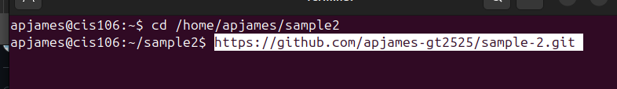

# How to create a github repository

* on the home page of github go to new 
* name the repository (name it whatever the teacher need you to name it)
* make sure the repository is public

# How to clone a github repository

* in your files make a new folder (the same name as you named the repository)
* once you open the file that you made, copy the file (this is located on the top of the)

* open a terminal 
* in the terminal paste the file name after using the cd command and press enter to run the code

* copy and paste the github http by clicking on clone repository on github (two different ways)

* in the terminal paste the http from github (as a command)

* after this is loaded it will ask or your github username: apjames-gt2525 and password: Applepie....

# Github commands to run it/save on github

* git add .
* git comment -m "Comleted final exam" (if that's the name of the work being done)
* git push

# Absolute path
the very top of the tree, the main trunk where everything starts, called the root directory- represented by a forward slash /
* Example: /home/john/Documents/my_documents.txt
* breakdown: /: Starts at the root directory
* home/: goes into the home directory
* john/: goes into the john directory (personal folder)
* Documents/: goes into the documents folder
* my_documents.txt: finally, I find the file named my-documents.txt

# Relative path
is telling someone how to get to another file or folder starting from where you are right now, no need to give the whole address starting from the root.
# Special short cuts 
* . (dot): "the current" directory-the folder im in now. Example: type ./program_name
* .. (double dot): "the parent directory" the folder one level up from where I am, /home/user/documents to go to user folder use .. example: /home/user/documents/my_report.txt/pictures/vacation.jpg to go to pictures folder use: ../pictures

# When should you use absolute vs relative
Absolute path is giving the complete file from the beginning
 using the root directory which is / symbol
 * example: to access the vacation.jpg give /home/user/pictures/vacation.jpg
 * Used: when you need to be precise and unambiguous, in system-level congifurations, and the location is fixed and won't change

Relative path is like giving direction from current location (only works if I know where I am in the file system).
* use . or .. 
* Example: if you are currently in the /home/user/documents folder, and you want to refer to the vacation.jpg file, the relative path would be:
../pictures/vacation.jpg
This tells Linux to go one level up (.. which takes you to /home/user), and then go into the pictures folder, and finally find vacation.jpg.

# How to list from github sorted by last modification and extension example:
* cd; ls -tx your-github-repository/

# How to list from github recursively and in reversse order example:
* ls -rR ~/your-cis-directory/

# script for environment variable example
* current user- "The urrent User: $USER"
* current shell- "----------Shell: $---"
* current user home- "----------: $---"
* path variable -e "The Path Var: \n $--"

* then run in a terminal with bas and the name of the file it is saved as 
  * example: bash scripts/"then file name"