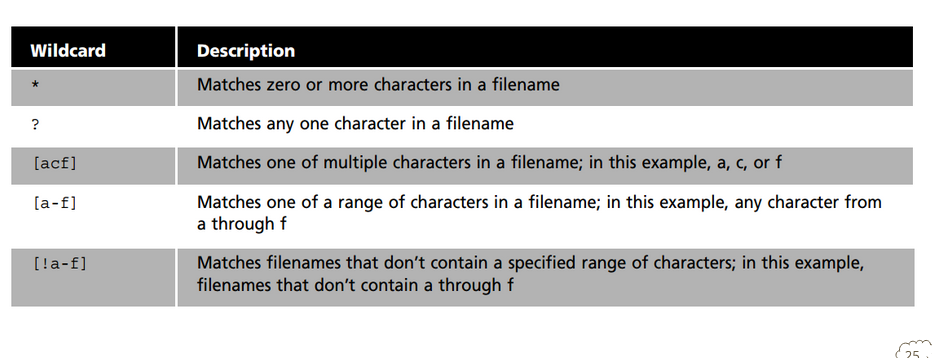

# Notes 6

## * Wildcard

* Matches 0 to any number of character

### Examples:

* list all the txt files:
  * ls*txt
  * notes.txt
  * report.txt

## ? Wildcard

* Matches only one character at a time

### Examples:

* Finding single-character 
  * ls file?.txt
    * file1.txt
    * file2.txt
    * fileA.txt

## [] Wildcard

* Allows me to match a range orspecific character within filenames.

### Examples:

* Finding specific file variations
  * ls file[1-3].txt
    * file1.txt
    * file2.txt
    * file3.txt

## Brace Expansion

* helps automate repetitive tasks. 

### Examples:

* create multiple directories
  * mkdir {Documents,Images,Videos}
* Generating a sequence of numbers
  * touch file_{1..5}.txt
    * generate- file_1.txt file_2.txt file_3.txt file_4.txt file_5.txt
* Combine multiple expansions
  * echo {A,B,C}{1,2}
    * output- A1 A2 B1 B2 C1 C2 